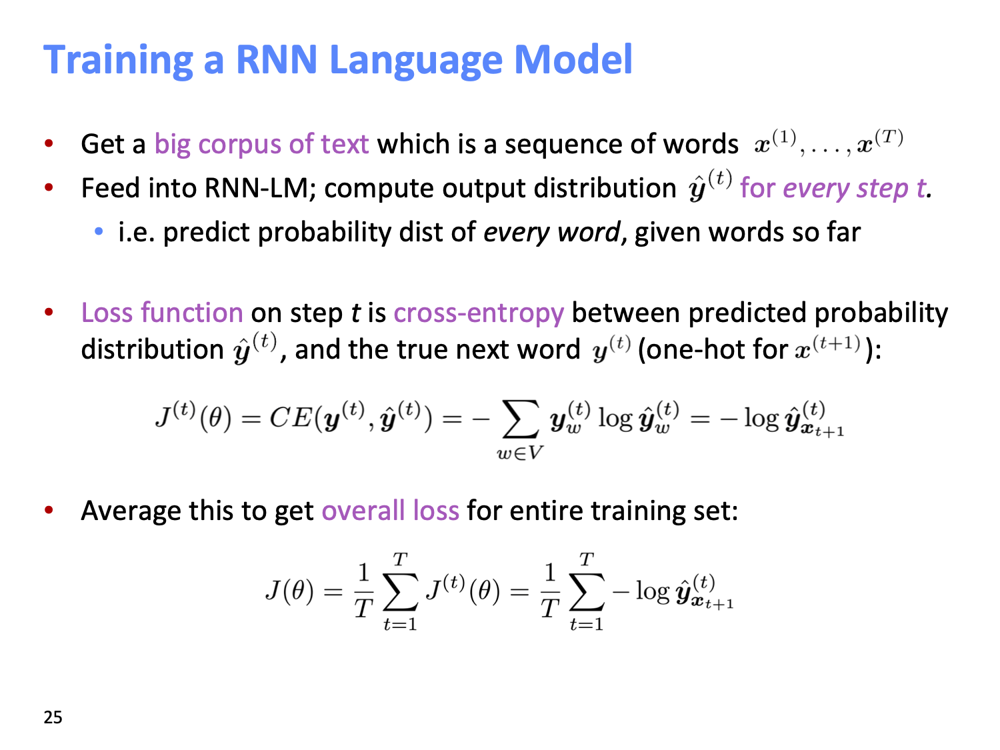

Language Modeling is the task of predicting what word comes next.

Models that assign probabilities to sequences of words are called language models or LMs. 

Language models compute the probability of occurrence of a number of words in a particular sequence. 

We’ll see how to use n-gram models to estimate the probability of the last word of an n-gram given the previous words, and also to assign probabilities to entire sequences. 

In later chapters we’ll introduce more sophisticated language models like the RNN LMs of Chapter 9.

N-Grams Language Model:

Let’s begin with the task of computing P(w|h), the probability of a word w given some history h. 
Suppose the history h is “its water is so transparent that” and we want to know the probability that the next word is "the":

P(the|its water is so transparent that). (3.1)

One way to estimate this probability is from relative frequency counts: 
Take a very large corpus, count the number of times we see "its water is so transparent that", and count the number of times this is followed by "the". This would be answering the question “Out of the times we saw the history h, how many times was it followed by the word w”, as follows:

P(the|its water is so transparent that) = C(its water is so transparent that the) / C(its water is so transparent that) (3.2)

While this method of estimating probabilities directly from counts works fine in many cases, it turns out that even the web isn’t big enough to give us good estimates in most cases. 

Howerver there are two issues with this approach: Either the neumerator or the denominator do not exists in the corpus.

This is because language is creative; new sentences are created all the time, and we won’t always be able to count entire sentences. Even simple extensions of the example sentence may have counts of zero on the web.

Secondly:
Similarly, if we wanted to know the joint probability of an entire sequence of words like "its water is so transparent", we could do it by asking “out of all possible sequences of five words, how many of them are "its water is so transparent?"”. We would have to get the count of "its water is so transparent" and divide by the sum of the counts of all possible five word sequences. That seems rather a lot to estimate!

Now how can we compute probabilities of entire sequences like P(w1 , w2 , ..., wn )? One thing we can do is decompose this probability using the chain rule of proba- bility:

Applying the chain rule to words, we get

P(wn) = P(w1)P(w2|w1)P(w3|w2,w1)...P(wn|wn−1,wn-2,...,w1)

  n
= ∏ P(wk|wk−1,...,w1) (3.4)
  k=1

But we still dont know how to calculate P(wk|wk-1,...w1) for all k=1..n.
As we said above, we can’t just estimate by counting the number of times every word occurs following every long string, because language is creative and any particular context might have never occurred before!

The intuition of the n-gram model is that instead of computing the probability of a word given its entire history, we can approximate the history by just the last few words.

The bigram model, for example, approximates the probability of a word given all the previous words P(wn|wn−1) by using only the conditional probability of the preceding word P(wn|wn−1). In other words, instead of computing the probability

P(the|Walden Pond’s water is so transparent that) (3.5) 
we approximate it with the probability
P(the|that) (3.6)

When we use a bigram model to predict the conditional probability of the next word, we are thus making the following approximation:
P(wn|wn−1) ≈ P(wn|wn−1)

Thus, the general equation for this n-gram approximation to the conditional probability of the next word in a sequence is
P(wn|wn−1_1) ≈ P(wn|wn−1_n−N+1 ) (3.8) 

Given the bigram assumption for the probability of an individual word, we can compute the probability of a complete word sequence by substituting Eq. 3.7 into Eq. 3.4:

P(wn1) ≈ ∏ P(wk|wk−1)  (3.9)

How do we estimate these bigram or n-gram probabilities? An intuitive way to estimate probabilities is called maximum likelihood estimation or MLE. We get the MLE estimate for the parameters of an n-gram model by getting counts from a corpus, and normalizing the counts so that they lie between 0 and 1.

For example, to compute a particular bigram probability of a word y given a previous word x, we’ll compute the count of the bigram C(xy) and normalize by the
sum of all the bigrams that share the same first word x: 
P(wn|wn−1) = C(wn−1,wn) / 􏰁w C(wn−1,w) (3.10)

We can simplify this equation, since the sum of all bigram counts that start with a given word wn−1 must be equal to the unigram count for that word wn−1 (the reader should take a moment to be convinced of this):
P(wn|wn−1) = C(wn−1,wn) / C(wn−1) (3.11) 

----
n-gram LM more succintly
The probability of a sequence of m words {w1, ..., wm} is denoted as P(w1, ..., wm). Since the number of words coming before a word, wi, varies depending on its location in the input document, P(w1, ..., wm) is usually conditioned on a window of n previous words rather than all previous words:

P(w1, ..., wm) = ∏ P(wi|w1, ..., wi−1) ≈ ∏ P(wi|wi−n, ..., wi−1) (1)

Uses: Equation 1 is especially useful for speech and translation systems when determining whether a word sequence is an accurate transla- tion of an input sentence. In existing language translation systems, for each phrase / sentence translation, the software generates a num- ber of alternative word sequences (e.g. {I have, I had, I has, me have, me had) and scores them to identify the most likely translation sequence.

1.2 n-gram Language Models
To compute the probabilities mentioned above, the count of each n-gram could be compared against the frequency of each word. This is called an n-gram Language Model. 

For instance, if the model takes bi-grams, the frequency of each bi-gram, calculated via combining a word with its previous word, would be divided by the frequency of the corresponding uni-gram. Equations 2 and 3 show this relationship for bigram and trigram models.
p(w2|w1) = count(w1, w2)/count(w1) (2) 
p(w3|w1, w2) = count(w1, w2, w3)/count(w1, w2) (3) 

But how long should the context be? In some cases, the window of past consecutive n words may not be suf- ficient to capture the context. For instance, consider the sentence "As the proctor started the clock, the students opened their ". If the window only conditions on the previous three words "the students opened their", the probabilities calculated based on the corpus may suggest that the next word be "books" - however, if n had been large enough to include the "proctor" context, the probability might have suggested "exam".

This leads us to two main issues with n-gram Language Models: Sparsity and Storage.
1. Sparsity problems with n-gram Language models
Sparsity problems with these models arise due to two issues.
Firstly, note the numerator of Equation 3. If w1, w2 and w3 never appear together in the corpus, the probability of w3 is 0. To solve this, a small δ could be added to the count for each word in the vocabulary. This is called smoothing.
Secondly, consider the denominator of Equation 3. If w1 and w2 never occurred together in the corpus, then no probability can be calculated for w3. To solve this, we could condition on w2 alone. This is called backoff.
Increasing n makes sparsity problems worse. Typically, n ≤ 5.
2. Storage problems with n-gram Language models
We know that we need to store the count for all n-grams we saw in the corpus. As n increases (or the corpus size increases), the model size increases as well.

Window-based Neural Language Model:
The "curse of dimensionality" above was first tackled by Bengio et al in A Neural Probabilistic Language Model, which introduced the first large-scale deep learning for natural language processing model.

This brings us to the main course of this lecture:
Recurrent Neural Networks (RNN):

RNN Advantages:
• Can process any length input
• Computation for step t can (in theory) use information from many steps back
• Model size doesn’t increase for longer input
• Same weights applied on every timestep, so there is symmetry in how inputs are processed.

RNN Disadvantages:
• Recurrent computation is slow
• In practice, difficult to access information from many steps back

2.2 Advantages, Disadvantages and Applications of RNNs RNNs have several advantages:
They can process input sequences of any length
The model size does not increase for longer input sequence lengths
Computation for step t can (in theory) use information from many steps back.
The same weights are applied to every timestep of the input, so there is symmetry in how inputs are processed
However, they also have some disadvantages:
Computation is slow - because it is sequential, it cannot be paral- lelized
In practice, it is difficult to access information from many steps back due to problems like vanishing and exploding gradients, which we discuss in the following subsection

Explain dimensions here: 
x1,...,xt−1,xt,xt+1,...xT:thewordvectorscorrespondingtoacor- pus with T words.
- ht = σ(W(hh)ht−1 + W(hx)xt): the relationship to compute the hidden layer output features at each time-step t
- xt ∈ Rd: input word vector at time t.
- Whx ∈ RDh×d: weights matrix used to condition the input word vector, xt
- Whh ∈ RDh×Dh: weights matrix used to condition the output of the previous time-step, ht−1
- ht−1 ∈ RDh : output of the non-linear function at the previous time-step, t − 1. h0 ∈ RDh is an initialization vector for the hidden layer at time-step t = 0.
- σ(): the non-linearity function (sigmoid here)

yˆ = so f tmax(W(S)h ): the output probability distribution over the vocabulary at each time-step t. Essentially, yˆ is the next predicted t
word given the document context score so far (i.e. ht−1) and the (t) (S) |V|×D |V|
lastobservedwordvectorx .Here,W ∈R h andyˆ∈R where |V| is the vocabulary.

How to Train RNNs

The amount of memory required to run a layer of RNN is pro- portional to the number of words in the corpus. We can consider a sentence as a minibatch, and a sentence with k words would have k word vectors to be stored in memory. Also, the RNN must maintain two pairs of W, b matrices. As aforementioned, while the size of W could be very large, it does not scale with the size of the corpus (un- like the traditional language models). For a RNN with 1000 recurrent layers, the matrix would be 1000 × 1000 regardless of the corpus size.
RNNs can be used for many tasks, such as tagging (e.g. part-of- speech, named entity recognition), sentence classification (e.g. sentiment classification), and encoder modules (e.g. questiton answering, machine translation, and many other tasks. In the latter two applica- tions, we want a representation for the sentence, which we can obtain by taking the element-wise max or mean of all hidden states of the timesteps in that sentence.

Application: tagging, sentence classification, question anser, machine translation, speech recognization, summarization etc.

# {TODO} {IMPORTANT} Backpropagation for RNNs
[TODO] Explain Vanishing gradient, gradient explosion

# Text Generation RNNs

# Note:
RNN discussed here are just "vanilla" RNNs and not used as it is.
More advanced forms of RNNs such as LSTM, GRU, multi layer, bi-directional used in practice which are discussed in lecture 07.

