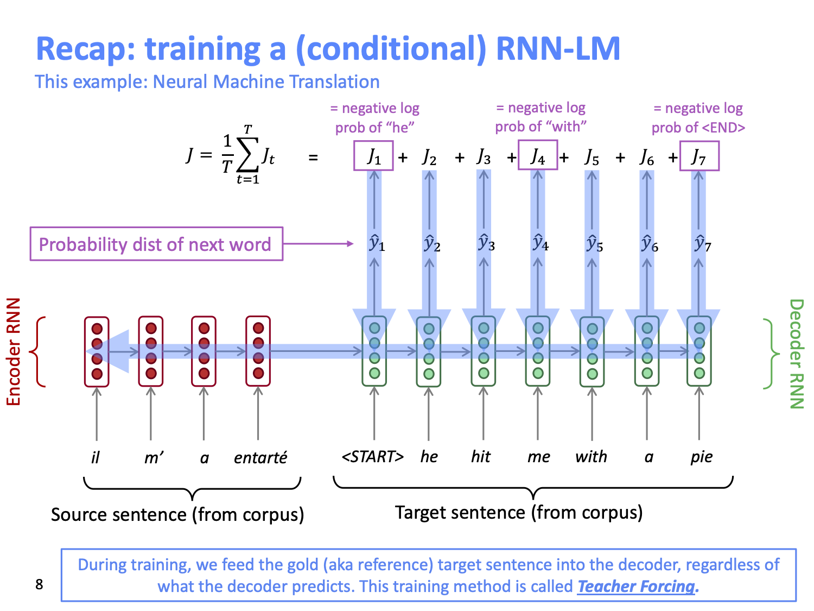
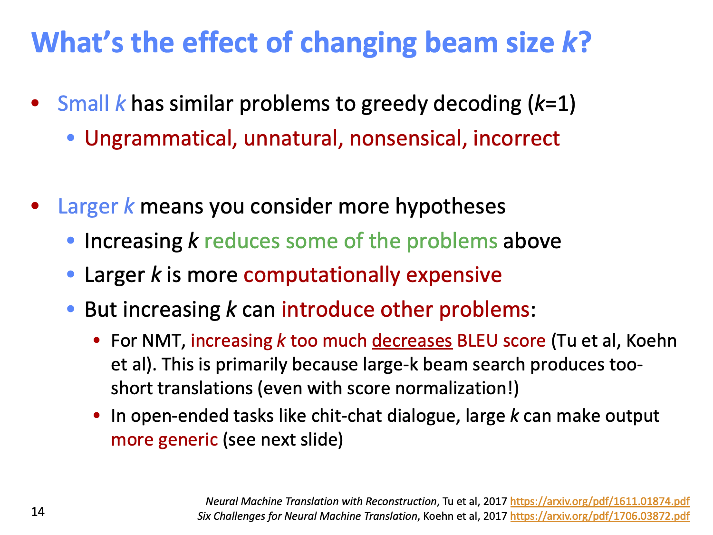

## Plan:
1. Recap what we already know about NLG
2. More on decoding algorithms
3. NLG tasks and neural approaches to them
4. BLG evaluation: a tricky situation
5. Concluding thought on NLG research, current trends and the future

### What is NLG:
NLG refers to any setting in which we generate new text.

NLG is a subcomponent of:
- Machine Translation
- (Abstractive) Summarizaiton
- Dialogue (chit-chat and task-based)
- Creative writing: Storytelling, poetry-generation
- Freeform Question Answering (i.e. anser is generated, not extracted from text or knowledge base)
- Image captioning
- etc.

## 1. Recap what we already know about NLG
- Language Modeling: the task of **predicting the next word**, given the words so far:
P(yt|y1,...,yt-1)
- A system that produces this probability distribution is called Language Model
- Contitional Language Modeling: the task of predicting the next word, given the words so far, **and also some other input x**
P(yt|y1,...,yt-1,x)
- Examples of Conditional Language modeling tasks:
  - Machine Translation (x=source sentence, y=trget sentence)
  - Summarization (x=input text, y=summarized text)
  - Dialogue (x=dialogue history, y=next utterance)
  - etc.

### Recap: training a (conditional) RNN-LM:

### Recap: decoding algorithms
Question: Once you’ve trained your (conditional) language model, how do you use it to generate text?
Answer: A decoding algorithm is an algorithm you use to generate text from your language model.

We’ve learnt about two decoding algorithms: 
- Greedy decoding
- Beam search

### One thing not discussed earlier about Beam Search:

### Another family of decoding algorithms: Sampling Based Decoding
- Pure sampling
- Top-n sampling

_Both of these are more efficient than Beam serach, no more multiple hypotheses_

### Softmax temperature
_Softmax temperature is not a decoding algorithm._
_It’s a technique you can apply at test time, in conjunction with a decoding algorithm (such as beam search or sampling)_

### Decoding algorithms: in summary
- Greedy decoding
- Beam search
- Sampling methods
- Softmax temperature

## 2. NLG tasks and neural approaches to them

### 2.1.1. Summarization: task definition
Task: given input text x, write a summary y which is shorter and contains the main information of x.
Summarization can be 
- Single-document 
- Multi-document

Training data sources:
- Gigaword
- LCSTS (Chinese microblogging)
- NYT, CNN/DailyMail
- Wikihow

**Sentence simplification:** is a different but related task: rewrite the source text in a simpler (sometimes shorter) way
- Simple Wikipedia: standard Wikipedia sentence → simple version
- Newsela: news article → version written for children

### 2.1.2. Summarization: How to do it
Two main strategies:
- **Extractive summarization:** Select parts (typically sentences) of the original text to form a summary.
- **Abstractive summarization:** Generate new text using natural language generation techniques.

#### Explanation about pre-neural way of summarization:
They were mostly extractive.
Like pre-neural MT, they typically had a pipeline:
- Content selection:
  - Sentence scoring functions: can be based on:
    - Presence of topic keywords,computed via e.g.tf-idf
    - Features such as where the sentence appears in the document
  - Graph-based algorithms: view the document as a set of sentences (nodes), with edges between each sentence pair
    - Edge weight is proportional to sentence similarity
    - Use graph algorithms to identify sentences which are central in the graph

- Information ordering
- Sentence realization

### 2.1.3. How to evaluate Summarization:
**ROUGE:** Recall-Oriented Understudy for Gisting Evaluation
_There is now a convenient Python implementation of ROUGE!_

### 2.1.4. Neural summarization (2015 - present)
2015: Rush et al. publish the first seq2seq summarization paper
Since 2015, there have been lots more developments!
Copy mechanisms use attention to enable a seq2seq system to easily copy words and phrases from the input to the output
- Clearly this is very useful for summarization
- Allowing both copying and generating gives us a **hybrid extractive/abstractive approach**
There are several papers proposing copy mechanism variants:

Big problem with copying mechanisms: 
- They copy too much!
- Mostly long phrases,sometimes even whole sentences
- What should be an abstractive system collapses to a mostly extractive system.
Another problem:
- They’re bad at overall content selection, especially if the input document is long
- No overall strategy for selecting content

### 2.1.5. One solution: bottom-up summarization:
Simple but effective!
- Content selection stage: Use a neural sequence-tagging model to tag words as include or don’t-include
- Bottom-up attention stage: The seq2seq+attention system can’t attend to words tagged don’t-include (apply a mask)

In 2017 Paulus et al published a “deep reinforced” summarization model
- A Deep Reinforced Model for Abstractive Summarization, Paulus et al, 2017 https://arxiv.org/pdf/1705.04304.pdf
- Blog post: https://www.salesforce.com/products/einstein/ai-research/tl-dr-reinforced-model-abstractive-summarization/

# This beginning to look like a paper tour

### 2.2.1. Dialogue
“Dialogue” encompasses a large variety of settings:
- Task-oriented dialogue
  - Assistive (e.g. customer service, giving recommendations, question answering, helping user accomplish a task like buying or booking something)
  - Co-operative (two agents solve a task together through dialogue)
  - Adversarial (two agents compete in a task through dialogue)
- Social dialogue
  - Chit-chat (for fun or company)
  - Therapy / mental wellbeing

### 2.2.2. Seq2seq-based dialogue
• However, it quickly became apparent that a naïve application of standard seq2seq+attention methods has serious pervasive deficiencies for (chitchat) dialogue:
• Genericness / boring responses
• Irrelevant responses (not sufficiently related to context) • Repetition
• Lack of context (not remembering conversation history) • Lack of consistent persona

### 2.2.3. Negotiation dialogue

Papers:
- A Neural Conversational Model, Vinyals et al, 2015 https://arxiv.org/pdf/1506.05869.pdf
- Neural Responding Machine for Short-Text Conversation, Shang et al, 2015 https://www.aclweb.org/anthology/P15-1152
- A Diversity-Promoting Objective Function for Neural Conversation Models, Li et al, 2016 https://arxiv.org/pdf/1510.03055.pdf
- Why are Sequence-to-Sequence Models So Dull?, Jiang et al, 2018 https://staff.fnwi.uva.nl/m.derijke/wp-content/papercite-data/pdf/jiang-why-2018.pdf
- A Persona-Based Neural Conversation Model, Li et al 2016, https://arxiv.org/pdf/1603.06155.pdf 
- Personalizing Dialogue Agents: I have a dog, do you have pets too?, Zhang et al, 2018 https://arxiv.org/pdf/1801.07243.pdf
- Deal or No Deal? End-to-End Learning for Negotiation Dialogues, Lewis et al, 2017 https://arxiv.org/pdf/1706.05125.pdf
- Hierarchical Text Generation and Planning for Strategic Dialogue, Yarats et al, 2018 https://arxiv.org/pdf/1712.05846.pdf

### 2.3.1. Storytelling
Most neural storytelling work uses some kind of prompt
- Generate a story-like paragraph given an image
- Generate a story given a brief writing prompt
- Generate the next sentence of a story, given the story so far (story continuation)
  - This is different to the previous two, because we are not concerned with the system’s performance over several generated sentences

- Neural storytelling is taking off!
  - The first Storytelling Workshop was held in 2018
  - It held a competition (generate a story to accompany a sequence of 5 images)

### 2.4.1. Poetry generation: Hafez
**Hafez:** a poetry generation system by Ghazvininejad et al
**Main idea:** Use a Finite State Acceptor (FSA) to define all possible sequences that obey the desired rhythm constraints. Then use the FSA to constrain the output of a RNN-LM.

### 2.5.1. Non-autoregressive generation for NMT

# Thoughts about this lecture
Actually This lecture does not provide a lot of practival things that can be utilized directly in your day job.
For this reasons, this writeup will be fairly superfecial and not comprehensive.

However it does provide very useful NLG task decription, current approaches and thier problems and papers/resources relevant these tasks. This writeup just aims to bring all this knowledge together in one place.
This is intented to serve as a starting point to anyone working on these problems.

## 3. NLG evaluation
How do we evaluate and compare the performance one NLG system to another?

Word overlap based metrics (BLEU, ROUGE, METEOR, F1, etc.) are not ideal for machine translation.

What about perplexity?
Word embedding based metrics?

We have no automatic metrics to adequately capture overall quality (i.e. a proxy for human quality judgment).
But we can define more focused automatic metrics to capture particular aspects of generated text:
• Fluency (compute probability w.r.t. well-trained LM)
• Correct style (prob w.r.t. LM trained on target corpus)
• Diversity (rare word usage, uniqueness of n-grams)
• Relevance to input (semantic similarity measures)
• Simple things like length and repetition
• Task-specific metrics e.g. compression rate for summarization
Though these don’t measure overall quality, they can help us track some important qualities that we care about.

Human evaluation
• Human judgments are regarded as the gold standard
• Of course, we know that human eval is slow and expensive
• ...but are those the only problems?
• Supposing you do have access to human evaluation:
Does human evaluation solve all of your problems?
• No!

### 3.x.x Detailed human eval of controllable chatbots
Ultimately, we designed a detailed human evaluation system that separates out the important factors that contribute to overall chatbot quality:
What makes a good conversation? How controllable attributes affect human judgments, See et al, 2019 https://arxiv.org/pdf/1902.08654.pdf

### Possible new avenues for NLG eval?

## 4. Thoughts on NLG research, current trends, and the future

### 4.1. Exciting current trends in NLG
• Incorporating discrete latent variables into NLG
• May help with modeling structure in tasks that really need it,
like storytelling, task-oriented dialogue, etc
• Alternatives to strict left-to-right generation • Parallel generation, iterative refinement,
top-down generation for longer pieces of text
• Alternative to maximum likelihood training with teacher forcing • More holistic sentence-level (rather than word-level)
objectives

Neural NLG community is rapidly maturing
• During the early years of NLP + Deep Learning, community was mostly transferring successful NMT methods to NLG tasks.
• Now, increasingly more inventive NLG techniques emerging, specific to non-NMT generation settings.
• Increasingly more (neural) NLG workshops and competitions, especially focusing on open-ended NLG:
• NeuralGenworkshop
• Storytellingworkshop
• Alexachallenge
• ConvAI2NeurIPSchallenge
• These are particularly useful to organize the community, increase reproducibility, standardize eval, etc.
• The biggest roadblock for progress is eval

8 things I’ve learnt from working in NLG
1.
The more open-ended the task, the harder everything becomes.
Constraints are sometimes welcome!
Aiming for a specific improvement can be more manageable
than aiming to improve overall generation quality.
If you’re using a LM for NLG: improving the LM (i.e. perplexity)
will most likely improve generation quality.
...but it's not the only way to improve generation quality.
Look at your output, a lot
5. You need an automatic metric, even if it's imperfect. • You probably need several automatic metrics.
6. If you do human eval, make the questions as focused as possible.
7. Reproducibility is a huge problem in today's NLP + Deep Learning, and a huger problem in NLG.
• Please, publicly release all your generated output along with your paper!
8. Working in NLG can be very frustrating. But also very funny...